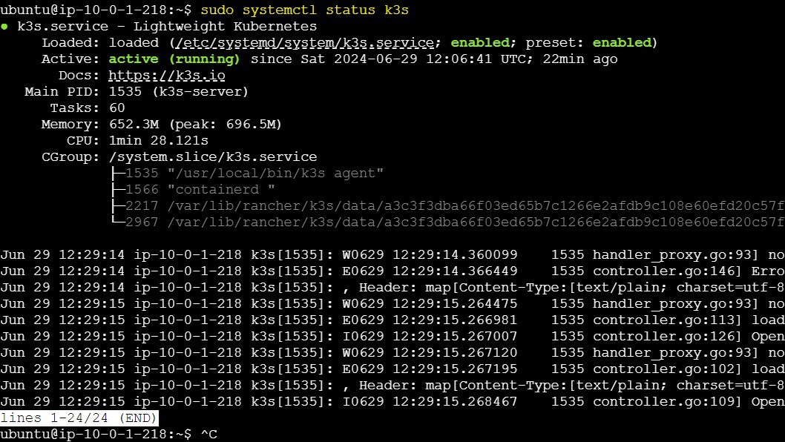

# Automating K3s cluster Deployment in AWS Using Pulumi and GitHub Actions

## Introduction

This guide outlines the steps to automate the deployment of a K3s cluster on AWS using Pulumi for infrastructure provisioning and GitHub Actions for continuous deployment. By automating this process, we can ensure consistent and reliable deployments of Kubernetes clusters on AWS instances.


### Prerequisites

Before proceeding, ensure you have the following:

- An AWS account with appropriate IAM permissions.
- Pulumi CLI installed locally and authenticated with your Pulumi account.
- GitHub repository set up to host your Pulumi project.
- Access to GitHub Secrets to securely store credentials and sensitive information.

## Project Structure
The project is organized into the following structure:

```sh
K3s-deployment-automation/
├── Infra/                    # Pulumi project directory
│   ├── __main__.py           # Pulumi Python script defining AWS resources
│   ├── Pulumi.dev.yaml
│   ├── Pulumi.yaml
│   ├── requirements.txt
│   ├── venv/                 # Virtual environment for Python dependencies 
│   └── ...                   # Other Pulumi project files and configurations
├── .github/                  # GitHub Actions workflows directory
│   └── workflows/
│       ├── infra.yml         # GitHub Actions workflow for deploying infrastructure
│       └── k3s-deploy.yml    # GitHub Actions workflow for deploying K3s
├── ...                       # Other project files and directories
```

## Setup Pulumi Project

1. **Initialize Pulumi Project**

   - Create a new directory for your Pulumi project:

     ```bash
     mkdir Infra
     cd Infra
     ```

   - Initialize a new Pulumi AWS Python project:

     ```bash
     pulumi new aws-python
     ```

2. **Define AWS Resources**

Write Python scripts (`__main__.py` or similar) to define AWS resources using Pulumi's AWS SDK.

```python
# Example Pulumi Python code to create AWS resources
import pulumi
import pulumi_aws as aws
import os

public_key = os.getenv("PUBLIC_KEY")

# Create the EC2 KeyPair using the public key
key_pair = aws.ec2.KeyPair("my-key-pair",
    key_name="my-key-pair",
    public_key=public_key)

# Define the VPC and subnet configurations
vpc = aws.ec2.Vpc("my-vpc",
    cidr_block="10.0.0.0/16",
    enable_dns_hostnames=True,
    enable_dns_support=True,
)

# Create Public Subnet
public_subnet = aws.ec2.Subnet("public-subnet",
    vpc_id=vpc.id,
    cidr_block="10.0.1.0/24",
    map_public_ip_on_launch=True,
    availability_zone="ap-southeast-1a",
)

# Create Internet Gateway
igw = aws.ec2.InternetGateway("igw",
    vpc_id=vpc.id,
)

# Create Route Table
route_table = aws.ec2.RouteTable("route-table",
    vpc_id=vpc.id,
    routes=[{
        "cidr_block": "0.0.0.0/0",
        "gateway_id": igw.id,
    }],
)

# Associate Route Table with Public Subnet
rt_assoc_public = aws.ec2.RouteTableAssociation("rt-assoc-public",
    subnet_id=public_subnet.id,
    route_table_id=route_table.id,
)

# Create Security Group
security_group = aws.ec2.SecurityGroup("web-secgrp",
    description='Enable SSH and K3s access',
    vpc_id=vpc.id,
    ingress=[
        {
            "protocol": "tcp",
            "from_port": 22,
            "to_port": 22,
            "cidr_blocks": ["0.0.0.0/0"],
        },
        {
            "protocol": "tcp",
            "from_port": 6443,
            "to_port": 6443,
            "cidr_blocks": ["0.0.0.0/0"],
        },
    ],
    egress=[{
        "protocol": "-1",
        "from_port": 0,
        "to_port": 0,
        "cidr_blocks": ["0.0.0.0/0"],
    }],
)

ami_id = "ami-003c463c8207b4dfa"  # Replace with a valid AMI ID for your region
instance_type = "t3.small"

master_node = aws.ec2.Instance("master-node",
    instance_type=instance_type,
    ami=ami_id,
    subnet_id=public_subnet.id,
    key_name=key_pair.key_name,
    vpc_security_group_ids=[security_group.id],
    tags={
        "Name": "Master-node"
    })


worker_node_1 = aws.ec2.Instance("worker-node-1",
    instance_type=instance_type,
    ami=ami_id,
    subnet_id=public_subnet.id,
    key_name=key_pair.key_name,
    vpc_security_group_ids=[security_group.id],
    tags={
        "Name": "Worker-node-1"
    })

worker_node_2 = aws.ec2.Instance("worker-node-2",
    instance_type=instance_type,
    ami=ami_id,
    subnet_id=public_subnet.id,
    key_name=key_pair.key_name,
    vpc_security_group_ids=[security_group.id],
    tags={
        "Name": "Worker-node-2"
    })

# Export outputs
pulumi.export("master_public_ip", master_node.public_ip)
pulumi.export("worker1_public_ip", worker_node_1.public_ip)
pulumi.export("worker2_public_ip", worker_node_2.public_ip)
```

3. **Commit Pulumi Project to GitHub**

Commit your Pulumi project to your GitHub repository for version control and automated deployment.

## Configure secrets

### 1. Generate SSH Keys Locally and save as a github secrets

Generate a new SSH key pair on your local machine. This key pair will be used to SSH into the EC2 instances.

```sh
ssh-keygen -t rsa -b 2048
```

This will generate two files, typically in the `~/.ssh` directory:
- `id_rsa` (private key)
- `id_rsa.pub` (public key)

### 2. Go to the SSH Folder

Navigate to the `.ssh` directory where the keys were generated.

```sh
cd ~/.ssh
```

### 3. Get the Public Key and Add It to GitHub Secrets

1. Open the `id_rsa.pub` file and copy its contents.
   
   ```sh
   cat id_rsa.pub
   ```
2. Open the `id_rsa` file and copy its contents.
   
   ```sh
   cat id_rsa
   ```
## Save secrets and AWS credentials as Github secrets

1. Go to your GitHub repository.
2. Navigate to **Settings** > **Secrets and variables** > **Actions** > **New repository secret**.
3. Add these secrets named:

  - `PUBLIC_KEY` -> `id_rsa.pub`

  - `SSH_PRIVATE_KEY` -> `id_rsa`

  - `AWS_ACCESS_KEY_ID` -> `AWS access key`

  - `AWS_SECRET_ACCESS_KEY` -> `AWS secret key`

  

## Configure GitHub Actions for Infrastructure Deployment

1. **Create GitHub Actions Workflow (`infra.yml`)**

Define a workflow triggered on pushes to the `main` branch:

```yaml
name: Deploy Infrastructure

on:
  push:
    branches:
      - main

jobs:
  deploy:
    runs-on: ubuntu-latest

    steps:
      - name: Checkout code
        uses: actions/checkout@v3

      - name: Set up Python
        uses: actions/setup-python@v4
        with:
          python-version: '3.x'

      - name: Install dependencies
        run: |
          python -m venv venv
          source venv/bin/activate
          pip install pulumi pulumi-aws

      - name: Configure AWS credentials
        uses: aws-actions/configure-aws-credentials@v2
        with:
          aws-access-key-id: ${{ secrets.AWS_ACCESS_KEY_ID }}
          aws-secret-access-key: ${{ secrets.AWS_SECRET_ACCESS_KEY }}
          aws-region: ap-southeast-1

      - name: Pulumi login
        env:
          PULUMI_ACCESS_TOKEN: ${{ secrets.PULUMI_ACCESS_TOKEN }}
        run: pulumi login

      - name: Pulumi stack select
        run: pulumi stack select Konami33/Infra/dev --cwd Infra

      - name: Set public key environment variable
        run: echo "PUBLIC_KEY=${{ secrets.PUBLIC_KEY }}" >> $GITHUB_ENV

      - name: Pulumi refresh
        run: pulumi refresh --yes --cwd Infra

      - name: Pulumi up
        run: pulumi up --yes --cwd Infra

      - name: Save Pulumi outputs
        id: pulumi_outputs
        run: |
          MASTER_IP=$(pulumi stack output master_public_ip --cwd Infra)
          WORKER1_IP=$(pulumi stack output worker1_public_ip --cwd Infra)
          WORKER2_IP=$(pulumi stack output worker2_public_ip --cwd Infra)

          echo "MASTER_IP=$MASTER_IP" >> $GITHUB_ENV
          echo "WORKER1_IP=$WORKER1_IP" >> $GITHUB_ENV
          echo "WORKER2_IP=$WORKER2_IP" >> $GITHUB_ENV
        env:
          PULUMI_ACCESS_TOKEN: ${{ secrets.PULUMI_ACCESS_TOKEN }}
```

## Deploy K3s on AWS Instances

1. **Create GitHub Actions Workflow (`k3s-deploy.yml`)**

Define a workflow triggered on successful completion of the infrastructure deployment workflow (`infra.yml`):

```yaml
name: Deploy k3s

on:
  workflow_run:
    workflows: ["Deploy Infrastructure"]
    types:
      - completed

jobs:
  deploy-k3s:
    runs-on: ubuntu-latest

    steps:
      - name: Checkout code
        uses: actions/checkout@v3
      
      - name: Configure AWS credentials
        uses: aws-actions/configure-aws-credentials@v2
        with:
          aws-access-key-id: ${{ secrets.AWS_ACCESS_KEY_ID }}
          aws-secret-access-key: ${{ secrets.AWS_SECRET_ACCESS_KEY }}
          aws-region: ap-southeast-1

      - name: Pulumi login
        env:
          PULUMI_ACCESS_TOKEN: ${{ secrets.PULUMI_ACCESS_TOKEN }}
        run: pulumi login

      - name: Pulumi stack select
        run: pulumi stack select Konami33/Infra/dev --cwd Infra

      - name: Pulumi refresh
        run: pulumi refresh --yes --cwd Infra
      
      - name: Save Pulumi outputs
        id: pulumi_outputs
        run: |
          MASTER_IP=$(pulumi stack output master_public_ip --cwd Infra)
          WORKER1_IP=$(pulumi stack output worker1_public_ip --cwd Infra)
          WORKER2_IP=$(pulumi stack output worker2_public_ip --cwd Infra)

          echo "MASTER_IP=$MASTER_IP" >> $GITHUB_ENV
          echo "WORKER1_IP=$WORKER1_IP" >> $GITHUB_ENV
          echo "WORKER2_IP=$WORKER2_IP" >> $GITHUB_ENV

        env:
          PULUMI_ACCESS_TOKEN: ${{ secrets.PULUMI_ACCESS_TOKEN }}

      - name: Set up SSH agent
        uses: webfactory/ssh-agent@v0.5.3
        with:
          ssh-private-key: ${{ secrets.SSH_PRIVATE_KEY }}

      - name: Test SSH connection
        run: ssh -o StrictHostKeyChecking=no ubuntu@${{ env.MASTER_IP }} "echo Connected"

      - name: Deploy k3s master node
        run: |
          ssh -o StrictHostKeyChecking=no ubuntu@${{ env.MASTER_IP }} "curl -sfL https://get.k3s.io | sh -"

      - name: Deploy k3s worker node 1
        run: |
          MASTER_IP=${{ env.MASTER_IP }}
          WORKER1_IP=${{ env.WORKER1_IP }}
          NODE_TOKEN=$(ssh -o StrictHostKeyChecking=no ubuntu@$MASTER_IP "sudo cat /var/lib/rancher/k3s/server/node-token")
          ssh -o StrictHostKeyChecking=no ubuntu@$WORKER1_IP "curl -sfL https://get.k3s.io | K3S_URL=https://$MASTER_IP:6443 K3S_TOKEN=$NODE_TOKEN sh -"

      - name: Deploy k3s worker node 2
        run: |
          MASTER_IP=${{ env.MASTER_IP }}
          WORKER2_IP=${{ env.WORKER2_IP }}
          NODE_TOKEN=$(ssh -o StrictHostKeyChecking=no ubuntu@$MASTER_IP "sudo cat /var/lib/rancher/k3s/server/node-token")
          ssh -o StrictHostKeyChecking=no ubuntu@$WORKER2_IP "curl -sfL https://get.k3s.io | K3S_URL=https://$MASTER_IP:6443 K3S_TOKEN=$NODE_TOKEN sh -"     
```

## Testing and Validation

1. First commit and Push into your github repository

```sh
git add .
git commit -m "build and deploy"
git push -u origin main
```

2. **Monitor GitHub Actions Workflows**

   - Monitor the GitHub Actions dashboard for workflow runs (`infra.yml` and `k3s-deploy.yml`).
   - Review logs and outputs to troubleshoot any deployment issues.

   

1. **Verify K3s Deployment**
  - Enter into the Master Node ec2 instance and run this command to check if k3s is active

```sh
sudo systemctl status k3s
```
  

  - After deployment, verify the K3s cluster status using `kubectl` commands:

```bash
  kubectl get nodes
```
   - Ensure all nodes are ready and operational.

**Troubleshooting the file permission error**:
  - You might get error when you first time run this command `kubectl get nodes`:
```sh
ubuntu@ip-10-0-1-101:~$ kubectl get nodes
WARN[0000] Unable to read /etc/rancher/k3s/k3s.yaml, please start server with --write-kubeconfig-mode or --write-kubeconfig-group to modify kube config permissions 
error: error loading config file "/etc/rancher/k3s/k3s.yaml": open /etc/rancher/k3s/k3s.yaml: permission denied
```
The error indicates that the Kubernetes configuration file `/etc/rancher/k3s/k3s.yaml` has restricted permissions, preventing the `kubectl` command from reading it. This is a common issue when the configuration file is created with permissions that do not allow the current user to read it.

You can resolve this issue by modifying the permissions of the configuration file. 

- Change the Permissions of the kubeconfig File:

Run the following command on your master node to change the permissions of the kubeconfig file:

```sh
sudo chmod 644 /etc/rancher/k3s/k3s.yaml
```
This command sets the file permissions to be readable by `all` users.

- Verify Access:

Verify that the current user can read the configuration file:

```sh
cat /etc/rancher/k3s/k3s.yaml
```
If the file contents are displayed, the permissions are set correctly.


- Now Retry the kubectl command:
```sh
kubectl get nodes
```

This should resolve the `permission denied error` and allow you to use kubectl to interact with your Kubernetes cluster.


---

## Conclusion

This documentation provides a structured approach to automate the deployment of K3s clusters on AWS using Pulumi and GitHub Actions. Customize the provided workflows and scripts to fit your specific project requirements and infrastructure configurations. Regularly update and maintain your deployment workflows to ensure smooth and reliable operations.